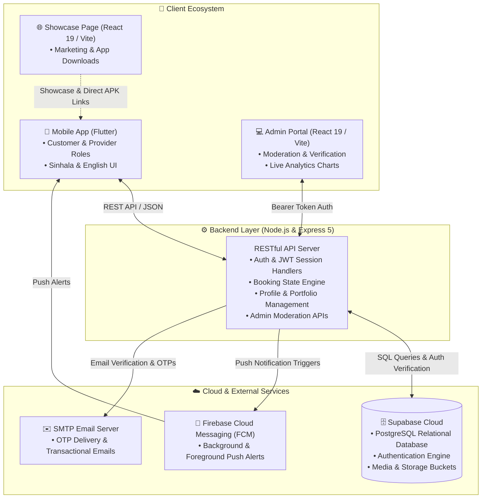

# 🇱🇰 Ape-Baas (අපේ බාස්) — On-Demand Home Services Ecosystem

[](https://flutter.dev/)
[](https://dart.dev/)
[](https://nodejs.org/)
[](https://expressjs.com/)
[](https://react.dev/)
[](https://vitejs.dev/)
[](https://tailwindcss.com/)
[](https://supabase.com/)
[](https://firebase.google.com/)

**Ape-Baas (අපේ බාස්)** is a modern, enterprise-grade, on-demand home service marketplace designed specifically for Sri Lanka. The platform seamlessly bridges the gap between everyday homeowners/businesses and verified local technicians, tradesmen, and craftsmen (*බාස්ලා*) across all 25 districts with full bilingual (Sinhala & English) support.

---

## 📑 Table of Contents

- [Key Highlights](#-key-highlights)
- [System Architecture](#-system-architecture)
- [Project Components](#-project-components)
  - [1. Mobile Application (`mobile_app/`)](#1-mobile-application-mobile_app)
  - [2. Backend REST API (`backend/`)](#2-backend-rest-api-backend)
  - [3. Administrative Dashboard (`admin-dashboard/`)](#3-administrative-dashboard-admin-dashboard)
  - [4. Customer Landing Web Page (`app-web-page/`)](#4-customer-landing-web-page-app-web-page)
- [Technology Stack](#-technology-stack)
- [Repository Structure](#-repository-structure)
- [Getting Started & Installation](#-getting-started--installation)
  - [Prerequisites](#prerequisites)
  - [1. Backend Setup](#1-backend-setup)
  - [2. Mobile Application Setup](#2-mobile-application-setup)
  - [3. Admin Dashboard Setup](#3-admin-dashboard-setup)
  - [4. Web Page Setup](#4-web-page-setup)
- [Environment Configuration](#-environment-configuration)
- [REST API Reference](#-rest-api-reference)
- [Security & Data Protection](#-security--data-protection)
- [License](#-license)

---

## 🌟 Key Highlights

- 🇱🇰 **Localized for Sri Lanka**: Native Sinhala & English interface, tailored district and town filtering across all 25 administrative districts.
- 🛡️ **Two-Tier Identity Verification**: Mandatory National Identity Card (NIC front & back) document review and admin approval workflow for service providers.
- 🔄 **Real-Time Booking Lifecycle**: Multi-step state machine (`Pending` ➔ `Accepted` ➔ `In-Progress` ➔ `Completed` / `Cancelled`) with automated status triggers.
- 🔔 **Instant Multi-Channel Alerts**: Firebase Cloud Messaging (FCM) push notifications and automated transactional email receipts via Nodemailer.
- 💬 **In-App Communication**: Direct real-time messaging channel between customers and assigned service providers for active bookings.
- ⭐ **Transparent Reputation Engine**: Genuine, verified post-job reviews, 5-star ratings, and public customer feedback.
- 📊 **Centralized Analytics**: Interactive metrics, revenue insights, provider moderation, and category management for platform administrators.

---

## 🏗️ System Architecture



---

## 📦 Project Components

### 1. Mobile Application (`mobile_app/`)
Built with **Flutter** (Dart 3.x) targeting Android and iOS with high performance and smooth 60fps animations.
- **Dual-Role Onboarding**: Single unified app with role-based dashboard switching for Customers and Service Providers.
- **Category Directory**: 50+ specialized service trades (Electrician, Plumber, Mason, Carpenter, A/C Technician, Painter, Solar Installer, Cleaner, Welder, etc.).
- **District & City Filter**: Granular geographical discovery matching customers with providers in their municipal/regional area.
- **Interactive Booking Flow**: Date & time selection, job description input, customer contact validation, and confirmation dialogues.
- **Provider Portfolio & Verification**: Upload and showcase completed work galleries and submit NIC verification documents directly within the app.
- **Push Notification Integration**: Foreground banners via `flutter_local_notifications` and background push via `firebase_messaging`.

### 2. Backend REST API (`backend/`)
Engineered on **Node.js** with **Express 5** and integrated with **Supabase PostgreSQL**.
- **Auth & Password Management**: Secure email registration, bcrypt password hashing, 6-digit OTP email generation, and session validation.
- **Booking Engine**: Enforces state validation, preventing illegal transitions and ensuring auditability.
- **Provider Aggregations**: Dynamic calculation of average ratings, verified badges, and review counts.
- **Admin Control Endpoints**: Bulk provider approvals, rejections with custom reasons, category toggles, and platform statistics.
- **Notification Services**: Firebase Admin SDK integration for topic-based and token-based device notifications.

### 3. Administrative Dashboard (`admin-dashboard/`)
Built with **React 19**, **Vite**, **Tailwind CSS**, and **Recharts**.
- **Executive Analytics Overview**: Live KPI metrics displaying Total Customers, Registered Providers, Pending Verifications, and Active Bookings.
- **Provider Document Verification**: High-resolution side-by-side inspection of NIC Front and Back images with instant Approve / Reject controls.
- **Service Category CRUD**: Dynamically create, rename, change icons, and enable/disable service categories across the entire system.
- **User Moderation**: Detailed user tables with search, status filtering, and profile auditing.

### 4. Customer Landing Web Page (`app-web-page/`)
Built with **React 19**, **Vite**, and **Tailwind CSS**.
- **Product Showcase**: Highlights key platform benefits, safety guarantees, and popular service categories.
- **Responsive Layout**: Pixel-perfect presentation optimized for smartphones, tablets, and desktop browsers.
- **Direct Downloads**: Actionable Call-to-Action (CTA) buttons linking to Android APK downloads and mobile app stores.

---

## 💻 Technology Stack

| Component | Technology | Version | Purpose |
| :--- | :--- | :--- | :--- |
| **Mobile App** | `Flutter` / `Dart` | `3.10+` / `3.x` | Cross-platform client for Android & iOS |
| **Backend Framework** | `Express.js` | `5.2.1` | Modular, secure RESTful API |
| **Runtime** | `Node.js` | `v18+` | Server execution environment |
| **Database & Auth** | `Supabase` (`PostgreSQL`) | `2.110.8` | Cloud DB, authentication & media storage |
| **Push Notifications** | `Firebase Admin` / `FCM` | `12.0.0` | Cloud Messaging & push notifications |
| **Email Transports** | `Nodemailer` | `6.9.14` | Transactional email & OTP delivery |
| **Admin Frontend** | `React` / `Vite` | `19.0.0` / `6.1.0` | Single-Page Application (SPA) dashboard |
| **Dashboard Charts** | `Recharts` | `2.15.1` | Interactive visual data graphs |
| **Styling & Icons** | `Tailwind CSS` / `Lucide` | `3.4+` / `0.475+` | Modern design system & crisp icon sets |

---

## 📁 Repository Structure

```text
Ape-Baas/
├── .gitignore                         # Master gitignore configuration
├── README.md                          # Platform documentation
│
├── backend/                           # Node.js Express REST API
│   ├── config/                        # Service account & Firebase configs
│   │   └── firebase-service-account.json
│   ├── src/
│   │   ├── config/                    # Supabase database clients
│   │   ├── controllers/               # Business logic (auth, admin, bookings, etc.)
│   │   ├── routes/                    # API route endpoints
│   │   └── services/                  # Email & Notification helper services
│   ├── seedCategories.js              # Database initial seeding script
│   ├── package.json                   # Dependencies & npm scripts
│   └── server.js                      # Express server entry point
│
├── mobile_app/                        # Flutter Mobile Application
│   ├── android/                       # Android native files & Gradle configs
│   ├── ios/                           # iOS native files & Xcode configs
│   ├── assets/                        # Static assets, branding, and icons
│   ├── lib/
│   │   ├── screens/                   # Customer & Provider UI screens
│   │   ├── services/                  # ApiService, NotificationService
│   │   ├── utils/                     # AppColors, constants, styles
│   │   ├── widgets/                   # Modular UI components
│   │   └── main.dart                  # Flutter entry point
│   └── pubspec.yaml                   # Flutter dependencies & assets
│
├── admin-dashboard/                   # React 19 + Vite Admin Portal
│   ├── src/
│   │   ├── components/                # UI modals, cards, verification viewers
│   │   ├── pages/                     # Dashboard, Users, Providers, Categories
│   │   ├── services/                  # Admin API integration service
│   │   ├── App.jsx                    # Root React component
│   │   └── main.jsx                   # React mounting point
│   ├── package.json                   # React dependencies & scripts
│   └── vite.config.js                 # Vite build settings
│
└── app-web-page/                      # React 19 + Vite Landing Page
    ├── src/
    │   ├── components/                # Hero, Features, Testimonials, CTAs
    │   └── App.jsx                    # Landing page layout
    ├── package.json                   # Dependencies
    └── vite.config.js                 # Vite configuration
```

---

## 🚀 Getting Started & Installation

### Prerequisites
Ensure the following tools are installed on your workstation:
- **[Node.js (v18 or higher)](https://nodejs.org/)** and `npm`
- **[Flutter SDK (v3.10+)](https://flutter.dev/docs/get-started/install)**
- **[Git](https://git-scm.com/)**
- **Android Studio** / **VS Code** with Flutter & Dart extensions

---

### 1. Backend Setup

```bash
# Navigate to the backend directory
cd backend

# Install project dependencies
npm install

# Create and configure environment variables
cp .env.example .env   # Or create .env manually (see guide below)

# (Optional) Seed standard 50+ service categories into database
npm run seed:categories

# Start development server with live reload
npm run dev
```
> API Server starts listening at: `http://localhost:5000`

---

### 2. Mobile Application Setup

```bash
# Navigate to the mobile app directory
cd mobile_app

# Fetch required Flutter packages
flutter pub get

# Verify connected device or simulator
flutter devices

# Run on selected device or emulator
flutter run
```

---

### 3. Admin Dashboard Setup

```bash
# Navigate to the admin dashboard directory
cd admin-dashboard

# Install React dependencies
npm install

# Start Vite local development server
npm run dev
```
> Admin Dashboard is accessible at: `http://localhost:5173`

---

### 4. Web Page Setup

```bash
# Navigate to the web page directory
cd app-web-page

# Install dependencies
npm install

# Start Vite server
npm run dev
```
> Showcase Landing Page is accessible at: `http://localhost:5174`

---

## 🔐 Environment Configuration

Create a `.env` file in the `backend/` directory:

```env
# Server Config
PORT=5000
NODE_ENV=development

# Supabase Credentials (from Supabase Project Settings -> API)
SUPABASE_URL=https://your-project-id.supabase.co
SUPABASE_KEY=your-supabase-service-role-or-anon-key

# Nodemailer / SMTP Credentials (for OTP & Email Alerts)
SMTP_HOST=smtp.gmail.com
SMTP_PORT=587
SMTP_USER=your-platform-email@gmail.com
SMTP_PASS=your-app-specific-password

# Firebase Cloud Messaging Service Account (Path to JSON)
FIREBASE_SERVICE_ACCOUNT_PATH=./config/firebase-service-account.json
```

---

## 📡 REST API Reference

### Authentication (`/api/auth`)
| Method | Endpoint | Description | Access |
| :--- | :--- | :--- | :--- |
| `POST` | `/api/auth/register` | Register customer or service provider | Public |
| `POST` | `/api/auth/login` | Authenticate user & issue access session | Public |
| `POST` | `/api/auth/forgot-password` | Send password recovery OTP via email | Public |
| `POST` | `/api/auth/verify-otp` | Validate 6-digit password reset OTP | Public |
| `POST` | `/api/auth/reset-password` | Set new password with valid token | Public |
| `PUT` | `/api/auth/profile/update` | Update user personal & business profile | Authenticated |

### Providers & Categories (`/api/providers`, `/api/categories`)
| Method | Endpoint | Description | Access |
| :--- | :--- | :--- | :--- |
| `GET` | `/api/categories` | Retrieve all active service categories | Public |
| `GET` | `/api/providers` | Query & filter providers by category/district | Public |
| `GET` | `/api/providers/:id` | Fetch provider details, reviews, and portfolio | Public |
| `PUT` | `/api/providers/:id/nic` | Submit NIC front/back verification images | Provider |
| `PUT` | `/api/providers/:id/portfolio` | Update completed work image portfolio | Provider |

### Bookings & Messaging (`/api/bookings`, `/api/messages`)
| Method | Endpoint | Description | Access |
| :--- | :--- | :--- | :--- |
| `POST` | `/api/bookings` | Create new home service job booking | Customer |
| `GET` | `/api/bookings/customer/:id` | Fetch customer booking history & status | Authenticated |
| `GET` | `/api/bookings/provider/:id` | Fetch incoming provider job requests | Authenticated |
| `PUT` | `/api/bookings/:id/status` | Update booking status (`Accepted`, `Completed`, etc.) | Authenticated |
| `POST` | `/api/reviews` | Submit provider rating & customer review | Customer |
| `GET` | `/api/messages/:bookingId` | Retrieve chat message history for job | Authenticated |
| `POST` | `/api/messages` | Send message between customer and provider | Authenticated |

### Admin Oversight (`/api/admin`)
| Method | Endpoint | Description | Access |
| :--- | :--- | :--- | :--- |
| `GET` | `/api/admin/stats` | Platform statistics, totals & revenue graphs | Admin |
| `GET` | `/api/admin/providers` | View all providers & pending verification queues | Admin |
| `PUT` | `/api/admin/providers/:id/verify` | Approve or Reject provider verification with reason | Admin |
| `POST` | `/api/admin/categories` | Create new service category | Admin |
| `PUT` | `/api/admin/categories/:id` | Update category label, status, or icon | Admin |

---

## 🛡️ Security & Data Protection

1. **Credential Safety**: Sensitive keys, Supabase service credentials, and SMTP secrets are kept in `.env` and strictly excluded via `.gitignore`.
2. **Database Security**: Supabase Row Level Security (RLS) protects unauthorized read/write access across user records.
3. **Payload Sanitization**: Robust validation and strict JSON body constraints prevent injection attacks and memory exhaustion.
4. **Bcrypt Encryption**: All user passwords and secret credentials are encrypted with cryptographic salt rounds.

---

## 📄 License

This project is licensed under the [ISC License](LICENSE).

---

<p align="center">
  <b>Developed with ❤️ for Sri Lanka's skilled workforce 🇱🇰</b><br/>
  <sub>Ape-Baas Platform — Connecting Trust, Empowering Skills</sub>
</p>
