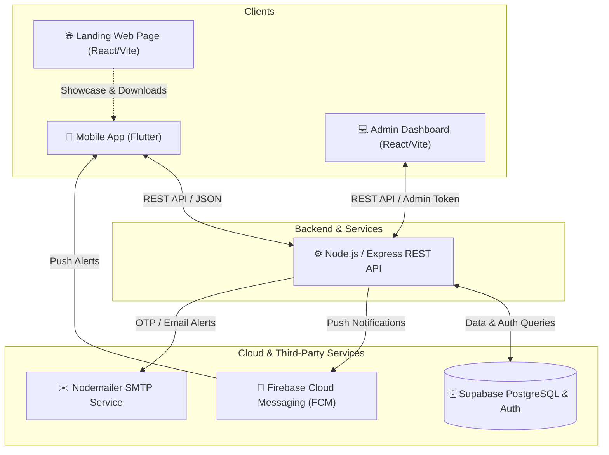

# 🛠️ Home Service Platform (Guide Lanka)

[](https://nodejs.org/)
[](https://expressjs.com/)
[](https://flutter.dev/)
[](https://react.dev/)
[](https://vitejs.dev/)
[](https://tailwindcss.com/)
[](https://supabase.com/)
[](https://firebase.google.com/)

A modern, full-stack, on-demand home service booking ecosystem. The platform seamlessly connects customers with verified service professionals (plumbers, electricians, cleaners, mechanics, technicians, etc.) while providing real-time job tracking, messaging, push notifications, and a centralized administrative dashboard.

---

## 📌 Table of Contents

- [System Architecture](#-system-architecture)
- [Project Components](#-project-components)
  - [1. Backend API (`backend/`)](#1-backend-api-backend)
  - [2. Mobile Application (`mobile_app/`)](#2-mobile-application-mobile_app)
  - [3. Admin Dashboard (`admin-dashboard/`)](#3-admin-dashboard-admin-dashboard)
  - [4. Landing Web Page (`app-web-page/`)](#4-landing-web-page-app-web-page)
- [Tech Stack](#-tech-stack)
- [Directory Structure](#-directory-structure)
- [Getting Started](#-getting-started)
  - [Prerequisites](#prerequisites)
  - [1. Backend Setup](#1-backend-setup)
  - [2. Admin Dashboard Setup](#2-admin-dashboard-setup)
  - [3. Mobile App Setup](#3-mobile-app-setup)
  - [4. Web Page Setup](#4-web-page-setup)
- [Environment Variables Guide](#-environment-variables-guide)
- [API Endpoints Overview](#-api-endpoints-overview)
- [Security & Best Practices](#-security--best-practices)
- [License](#-license)

---

## 🏗️ System Architecture



---

## 📦 Project Components

### 1. Backend API (`backend/`)
Built with **Node.js** and **Express 5**, providing a secure, scalable RESTful API.
- 🔐 **Authentication & Authorization**: Secure user registration, login, role management (Customer, Provider, Admin), password reset & OTP verification.
- 🧑‍🔧 **Provider Management**: Profile setup, service category association, rating calculations, availability, and verification status.
- 📅 **Booking Engine**: Booking creation, status lifecycle management (`Pending` ➔ `Accepted` ➔ `In-Progress` ➔ `Completed` / `Cancelled`).
- 💬 **Messaging**: Chat APIs for real-time customer-provider communication.
- ⭐ **Reviews & Feedback**: Star ratings and verified review submissions.
- 🔔 **Push Notifications**: Firebase Admin SDK integration for instant status updates and push notifications.
- 📊 **Admin Analytics**: Aggregated metrics, user moderation, and platform oversight.

### 2. Mobile Application (`mobile_app/`)
Cross-platform mobile application developed with **Flutter** for Android and iOS.
- 🎨 Modern, intuitive UI with responsive layouts and fluid micro-animations.
- 🔍 Category-based service discovery and search filters.
- 📅 Interactive date & time picker for scheduling bookings.
- 🔔 Firebase Cloud Messaging (FCM) and `flutter_local_notifications` for background/foreground alerts.
- 📷 Profile image uploading & cropping (`image_picker`, `image_cropper`).
- 📞 Direct communication & in-app chat with service providers.

### 3. Admin Dashboard (`admin-dashboard/`)
Single Page Application (SPA) built with **React 19**, **Vite**, **Tailwind CSS**, and **Recharts**.
- 📈 Real-time visual metrics (Total Users, Verified Providers, Active Bookings, Revenue).
- 👥 User & Provider Management (verify credentials, toggle status, review profiles).
- 📂 Category Management (create, edit, organize service categories).
- 📋 Full booking audit trail and dispute resolution.

### 4. Landing Web Page (`app-web-page/`)
High-converting promotional landing page built with **React**, **Vite**, and **Tailwind CSS**.
- 🌟 Feature highlights, service showcase, and customer testimonials.
- 📲 Mobile app download links (Direct APK / Play Store / App Store links).
- 📱 Fully responsive for all screen sizes (mobile, tablet, desktop).

---

## 💻 Tech Stack

| Domain | Technology / Library | Description |
| :--- | :--- | :--- |
| **Backend Core** | `Node.js`, `Express 5` | REST API Server |
| **Database & Auth** | `Supabase` (`@supabase/supabase-js`) | PostgreSQL Database & Storage |
| **Push Notifications** | `Firebase Admin SDK`, `firebase_messaging` | Cloud Messaging / Push Alerts |
| **Email Service** | `Nodemailer` | SMTP Transports & OTP Delivery |
| **Mobile Client** | `Flutter (Dart 3.x)` | Cross-platform Mobile App (Android/iOS) |
| **Web & Admin UI** | `React 19`, `Vite` | Fast modern Single-Page Applications |
| **Styling** | `Tailwind CSS`, `Lucide React` | Utility-first CSS & Modern Icons |
| **Data Visualization** | `Recharts` | Interactive Dashboard Charts |

---

## 📁 Directory Structure

```text
home-service-project/
├── .gitignore                     # Workspace root gitignore
├── README.md                      # Platform documentation
│
├── backend/                       # Express.js REST API Server
│   ├── config/                    # Configuration & Service Account keys
│   ├── src/
│   │   ├── config/                # Supabase & DB client configs
│   │   ├── controllers/           # Business logic & Route handlers
│   │   └── routes/                # API Route definitions
│   ├── .env                       # Backend Environment Variables (Git-ignored)
│   ├── package.json
│   └── server.js                  # Main server entry point
│
├── mobile_app/                    # Flutter Mobile Application
│   ├── android/                   # Android native configuration
│   ├── ios/                       # iOS native configuration
│   ├── assets/                    # Images, icons, and fonts
│   ├── lib/
│   │   ├── screens/               # App UI screens & views
│   │   ├── services/              # API, Notification, Auth services
│   │   ├── widgets/               # Reusable UI components
│   │   └── main.dart              # Flutter application entry point
│   └── pubspec.yaml               # Flutter dependencies & metadata
│
├── admin-dashboard/               # React + Vite Admin Panel
│   ├── src/
│   │   ├── components/            # UI components, tables, charts
│   │   ├── pages/                 # Dashboard, Providers, Users, Bookings
│   │   └── App.jsx
│   ├── package.json
│   └── vite.config.js
│
└── app-web-page/                  # React + Vite Landing & Showcase Page
    ├── src/
    │   ├── components/            # Hero, Features, Testimonials, Downloads
    │   └── App.jsx
    ├── package.json
    └── vite.config.js
```

---

## 🚀 Getting Started

### Prerequisites
Make sure you have the following installed on your development machine:
- [Node.js (v18 or higher)](https://nodejs.org/) & `npm`
- [Flutter SDK (v3.10+)](https://flutter.dev/docs/get-started/install)
- [Android Studio](https://developer.android.com/studio) / Xcode (for iOS development)
- [Git](https://git-scm.com/)

---

### 1. Backend Setup

```bash
# Navigate to backend directory
cd backend

# Install dependencies
npm install

# Create environment configuration file
cp .env.example .env   # Or create .env manually (see guide below)

# Run in development mode with hot-reloading
npm run dev
```
> Server will start at: `http://localhost:5000`

---

### 2. Admin Dashboard Setup

```bash
# Navigate to admin-dashboard directory
cd admin-dashboard

# Install dependencies
npm install

# Start Vite dev server
npm run dev
```
> Admin Dashboard will be available at: `http://localhost:5173`

---

### 3. Mobile App Setup

```bash
# Navigate to mobile app directory
cd mobile_app

# Fetch Flutter dependencies
flutter pub get

# Check connected devices or start an emulator
flutter devices

# Run on selected device/emulator
flutter run
```

---

### 4. Web Page Setup

```bash
# Navigate to app-web-page directory
cd app-web-page

# Install dependencies
npm install

# Start Vite dev server
npm run dev
```
> Web Page will be available at: `http://localhost:5174`

---

## 🔐 Environment Variables Guide

Create a `.env` file in the `backend/` directory with the following configuration keys:

```env
# Server Configuration
PORT=5000
NODE_ENV=development

# Supabase Credentials
SUPABASE_URL=https://your-project-id.supabase.co
SUPABASE_KEY=your-supabase-service-or-anon-key

# Nodemailer / SMTP Configuration
SMTP_HOST=smtp.gmail.com
SMTP_PORT=587
SMTP_USER=your-email@gmail.com
SMTP_PASS=your-app-password

# Firebase Push Notification (Optional: path to service account json)
FIREBASE_SERVICE_ACCOUNT_PATH=./config/firebase-service-account.json
```

---

## 📡 API Endpoints Overview

| Method | Endpoint | Description | Access |
| :--- | :--- | :--- | :--- |
| `POST` | `/api/auth/register` | Register customer or provider | Public |
| `POST` | `/api/auth/login` | Login user & return session | Public |
| `POST` | `/api/auth/forgot-password` | Send password reset OTP | Public |
| `GET` | `/api/categories` | Get all service categories | Public |
| `GET` | `/api/providers` | Search / filter service providers | Public / User |
| `GET` | `/api/providers/:id` | Get provider profile & services | Public / User |
| `POST` | `/api/bookings` | Create new service booking | Authenticated |
| `GET` | `/api/bookings/my-bookings` | Get user/provider bookings | Authenticated |
| `PUT` | `/api/bookings/:id/status` | Update booking status | Authenticated |
| `POST` | `/api/reviews` | Submit service provider review | Authenticated |
| `GET` | `/api/messages/:bookingId` | Get chat history for booking | Authenticated |
| `GET` | `/api/admin/stats` | Retrieve platform dashboard analytics | Admin |
| `GET` | `/api/admin/providers` | Manage provider approvals & status | Admin |

---

## 🛡️ Security & Best Practices

1. **Environment Secrets**: Never commit `.env` or Firebase Service Account `.json` keys to source control. They are strictly tracked under `.gitignore`.
2. **Data Integrity**: Supabase Row-Level Security (RLS) policies safeguard sensitive customer and provider data.
3. **Payload Sanitization**: JSON and URL-encoded request payloads are handled with controlled size limits.

---

## 📄 License

This project is licensed under the [ISC License](LICENSE).
