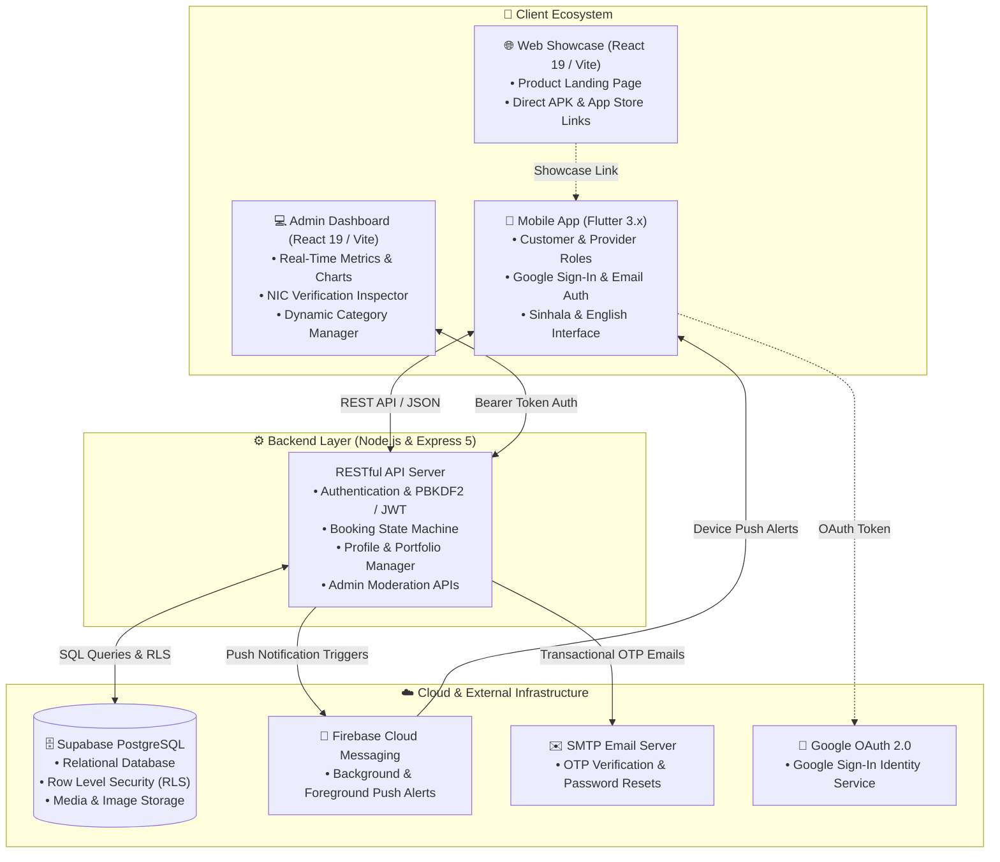

# 🛠️ Ape-Baas (අපේ බාස්) — On-Demand Home Services Ecosystem

<p align="center">
  
</p>

<p align="center">
  <b>Sri Lanka's Premier Digital Marketplace Connecting Homeowners & Businesses with Verified Local Technicians (*බාස්ලා*)</b><br/>
  <i>Full Bilingual Support (සිංහල / English) • Real-Time Bookings • Document-Verified Professionals • In-App Messaging</i>
</p>

<p align="center">
  <a href="https://flutter.dev/"></a>
  <a href="https://dart.dev/"></a>
  <a href="https://nodejs.org/"></a>
  <a href="https://expressjs.com/"></a>
  <a href="https://react.dev/"></a>
  <a href="https://vitejs.dev/"></a>
  <a href="https://tailwindcss.com/"></a>
  <a href="https://supabase.com/"></a>
  <a href="https://firebase.google.com/"></a>
  <a href="https://developers.google.com/identity"></a>
</p>

---

## 📑 Table of Contents

- [🌟 Platform Overview](#-platform-overview)
- [✨ Key Features](#-key-features)
- [🏗️ System Architecture](#-system-architecture)
- [📦 Project Modules](#-project-modules)
  - [1. Mobile Application (`mobile_app/`)](#1-mobile-application-mobile_app)
  - [2. Backend REST API (`backend/`)](#2-backend-rest-api-backend)
  - [3. Admin Dashboard (`admin-dashboard/`)](#3-administrative-dashboard-admin-dashboard)
  - [4. Web Showcase Landing Page (`app-web-page/`)](#4-customer-landing-web-page-app-web-page)
- [💻 Technology Stack](#-technology-stack)
- [📁 Repository Structure](#-repository-structure)
- [🚀 Quick Start & Installation](#-quick-start--installation)
  - [Prerequisites](#prerequisites)
  - [1. Backend Setup](#1-backend-setup)
  - [2. Mobile Application Setup](#2-mobile-application-setup)
  - [3. Admin Dashboard Setup](#3-admin-dashboard-setup)
  - [4. Web Showcase Setup](#4-web-showcase-setup)
- [🔐 Environment Configuration](#-environment-configuration)
- [📡 REST API Documentation](#-rest-api-documentation)
- [🛡️ Security & Privacy](#-security--privacy)
- [📞 Help & Support Contact](#-help--support-contact)
- [📄 License](#-license)

---

## 🌟 Platform Overview

**Ape-Baas (අපේ බාස්)** is an enterprise-grade, on-demand home and facility service marketplace tailored specifically for Sri Lanka. The platform bridges the gap between everyday consumers/businesses and skilled local technicians (*බාස්ලා*) — including Electricians, Plumbers, Carpenters, Masons, A/C Technicians, Painters, Movers, and more.

Built with a unified **Navy Blue brand identity (`#002B49`)**, bilingual localization, granular geographic filtering across all **25 Sri Lankan districts**, and end-to-end security, Ape-Baas transforms how home maintenance is discovered, booked, and verified.

---

## ✨ Key Features

| Category | Feature | Description |
| :--- | :--- | :--- |
| **Authentication** | 🔐 **Google Sign-In & OTP** | Instant "Continue with Google" sign-in via native account chooser + 6-digit email OTPs for secure registration & password recovery. |
| **Localization** | 🇱🇰 **100% Sri Lankan Context** | Full bilingual UI (Sinhala & English) with multi-level filtering by all 25 districts and local towns. |
| **Trust & Safety** | 🛡️ **Two-Tier NIC Verification** | Mandatory National Identity Card (NIC front & back) document upload reviewed and approved by Platform Administrators before a provider is listed. |
| **Booking Engine** | 📅 **Live Lifecycle State Machine** | Real-time booking management (`Pending` ➔ `Accepted` ➔ `In-Progress` ➔ `Completed` / `Cancelled`) with automated status triggers. |
| **Communication** | 💬 **In-App Live Chat** | Direct, real-time messaging channel between customers and assigned service providers for active jobs. |
| **Alerts** | 🔔 **Instant Push & Email Alerts** | Firebase Cloud Messaging (FCM) background/foreground push notifications + Nodemailer transactional emails. |
| **Reputation** | ⭐ **5-Star Rating & Portfolio** | Verified customer reviews, average star rating aggregations, and photo galleries of completed provider work. |
| **Administration** | 📊 **Executive Command Center** | Interactive KPI metrics, provider approval pipelines, category management, and broadcast notification broadcasts. |

---

## 🏗️ System Architecture



---

## 📦 Project Modules

### 1. Mobile Application (`mobile_app/`)
Built using **Flutter** (Dart 3.x) targeting Android and iOS with 60fps animations and responsive UI components.
- **Dual-Role Onboarding**: Single unified app with role-based dashboard switching for Customers and Service Providers.
- **Google Sign-In**: Official Google identity service with one-tap account picker and auto-profile sync.
- **Granular Filter System**: Search providers by 50+ trade categories, 25 districts, and local cities.
- **Provider Portfolio & Documents**: Providers upload showcase galleries and submit NIC verification documents directly within the app.
- **In-App Messaging**: Real-time chat for discussing job requirements, quotes, and addresses.
- **Push Notification Support**: Foreground heads-up banners via `flutter_local_notifications` and background push via `firebase_messaging`.

### 2. Backend REST API (`backend/`)
Engineered on **Node.js** with **Express 5** and connected to **Supabase PostgreSQL**.
- **Auth & Session Security**: Email/password authentication, Google OAuth verification, PBKDF2 cryptographic hashing, and 6-digit email OTPs.
- **Booking State Controller**: Enforces atomic state transitions, preventing invalid status workflows.
- **Rating & Analytics Engine**: Computes provider performance scores, review counts, and active jobs in real time.
- **Admin Moderation Services**: Fast APIs for provider verification, user management, and broadcast alerts.

### 3. Administrative Dashboard (`admin-dashboard/`)
Built with **React 19**, **Vite**, **Tailwind CSS**, and **Recharts**.
- **Executive Analytics Overview**: Live KPI cards showing Total Customers, Registered Providers, Pending Verifications, and Active Bookings.
- **Provider Verification Inspector**: High-resolution side-by-side inspection of NIC Front and Back images with instant Approve / Reject controls with reason notes.
- **Admin Profile Customization**: Direct device image upload and avatar drag-and-drop.
- **Category Manager**: Dynamically create, rename, change icons, and enable/disable service categories without redeploying backend code.

### 4. Customer Landing Web Page (`app-web-page/`)
Built with **React 19**, **Vite**, and **Tailwind CSS**.
- **Modern Showcase UI**: Highlights platform benefits, safety guarantees, and popular service categories.
- **Fully Responsive**: Optimized for smartphones, tablets, and wide-screen desktop displays.
- **Call to Action**: Quick download buttons for Android APKs and app store links.

---

## 💻 Technology Stack

| Domain | Technology | Version | Purpose |
| :--- | :--- | :--- | :--- |
| **Mobile App** | `Flutter` / `Dart` | `3.10+` / `3.x` | Cross-platform mobile app (Android & iOS) |
| **Google Sign-In** | `google_sign_in` | `6.2.2` | Native Google OAuth account selection |
| **Backend Framework** | `Express.js` | `5.2.1` | RESTful API server |
| **Server Runtime** | `Node.js` | `v18+` | Server execution environment |
| **Cloud Database** | `Supabase` (`PostgreSQL`) | `2.110.8` | Relational database & file storage |
| **Push Notifications** | `Firebase Admin` / `FCM` | `12.0.0` | Background & foreground push alerts |
| **Email Service** | `Nodemailer` | `6.9.14` | Transactional email & OTP delivery |
| **Admin Portal** | `React` / `Vite` | `19.0.0` / `6.1.0` | Admin SPA management dashboard |
| **Analytics Charts** | `Recharts` | `2.15.1` | Interactive visual data graphs |
| **CSS & Icons** | `Tailwind CSS` / `Lucide` | `3.4+` / `0.475+` | Utility-first styling & modern icons |

---

## 📁 Repository Structure

```text
Ape-Baas/
├── .gitignore                         # Master gitignore configuration
├── README.md                          # Comprehensive project documentation
│
├── backend/                           # Node.js Express REST API
│   ├── config/                        # Firebase service account configs
│   │   └── firebase-service-account.json
│   ├── src/
│   │   ├── config/                    # Supabase database connection
│   │   ├── controllers/               # Auth, Admin, Booking, Provider, Review logic
│   │   ├── routes/                    # Express route definitions
│   │   └── services/                  # Email & Push notification services
│   ├── seedCategories.js              # Database initial category seeder
│   ├── package.json                   # Backend dependencies & npm scripts
│   └── server.js                      # Express server entry point
│
├── mobile_app/                        # Flutter Mobile Application
│   ├── android/                       # Android native project & Gradle build files
│   ├── ios/                           # iOS native project & Xcode configs
│   ├── assets/                        # Images, branding logos, icons
│   │   └── images/google_logo.png     # Official Google high-resolution logo
│   ├── lib/
│   │   ├── screens/                   # Customer & Provider UI screens
│   │   ├── services/                  # ApiService, NotificationService
│   │   ├── utils/                     # AppColors, constants, styling tokens
│   │   ├── widgets/                   # Modular UI components
│   │   └── main.dart                  # Flutter entry point
│   └── pubspec.yaml                   # Flutter dependencies & asset declarations
│
├── admin-dashboard/                   # React 19 + Vite Admin Portal
│   ├── src/
│   │   ├── components/                # Admin profile, modals, tables, viewers
│   │   ├── pages/                     # Dashboard, Users, Providers, Categories
│   │   ├── services/                  # Admin API integration service
│   │   ├── App.jsx                    # Root React component
│   │   └── main.jsx                   # React mounting point
│   ├── package.json                   # React dependencies & scripts
│   └── vite.config.js                 # Vite build settings
│
└── app-web-page/                      # React 19 + Vite Landing Showcase Page
    ├── src/
    │   ├── components/                # Hero, Features, Testimonials, Footer
    │   ├── data/                      # Bilingual content dictionaries
    │   └── App.jsx                    # Landing page layout
    ├── package.json                   # Dependencies
    └── vite.config.js                 # Vite build settings
```

---

## 🚀 Quick Start & Installation

### Prerequisites
Make sure the following tools are installed on your workstation:
- **[Node.js (v18 or higher)](https://nodejs.org/)** and `npm`
- **[Flutter SDK (v3.10+)](https://flutter.dev/docs/get-started/install)**
- **[Git](https://git-scm.com/)**
- **Android Studio** / **VS Code** with Flutter & Dart extensions

---

### 1. Backend Setup

```bash
# Navigate to the backend directory
cd backend

# Install project dependencies
npm install

# Create and configure environment variables
cp .env.example .env   # Or create .env manually (see guide below)

# (Optional) Seed standard 50+ service categories into Supabase
node seedCategories.js

# Start development server with live reload
npm run dev
```
> 🚀 API Server starts listening at: `http://localhost:5000`

---

### 2. Mobile Application Setup

```bash
# Navigate to the mobile app directory
cd mobile_app

# Fetch required Flutter packages
flutter pub get

# Check available devices or connected Android emulator
flutter devices

# Run the application on connected device/emulator
flutter run
```

---

### 3. Admin Dashboard Setup

```bash
# Navigate to the admin dashboard directory
cd admin-dashboard

# Install React dependencies
npm install

# Start Vite local development server
npm run dev
```
> 💻 Admin Dashboard is accessible at: `http://localhost:3000` (or `http://localhost:5173`)

---

### 4. Web Showcase Setup

```bash
# Navigate to the web page directory
cd app-web-page

# Install dependencies
npm install

# Start Vite server
npm run dev
```
> 🌐 Landing Page is accessible at: `http://localhost:5174`

---

## 🔐 Environment Configuration

Create a `.env` file in the `backend/` directory:

```env
# Server Configuration
PORT=5000
NODE_ENV=development

# Supabase Credentials (from Supabase Project Settings -> API)
SUPABASE_URL=https://your-project-id.supabase.co
SUPABASE_KEY=your-supabase-service-role-or-anon-key

# Nodemailer / SMTP Credentials (for OTP & Email Alerts)
SMTP_HOST=smtp.gmail.com
SMTP_PORT=587
SMTP_USER=apebaaslk@gmail.com
SMTP_PASS=your-google-app-password

# Firebase Cloud Messaging Service Account (Path to JSON)
FIREBASE_SERVICE_ACCOUNT_PATH=./config/firebase-service-account.json
```

---

## 📡 REST API Documentation

### 🔑 Authentication (`/api/auth`)
| Method | Endpoint | Description | Access |
| :--- | :--- | :--- | :--- |
| `POST` | `/api/auth/register` | Register new customer or service provider | Public |
| `POST` | `/api/auth/login` | Authenticate user & issue session data | Public |
| `POST` | `/api/auth/google-login` | Google Sign-In & automatic user profile creation | Public |
| `POST` | `/api/auth/send-otp` | Send 6-digit registration OTP via email | Public |
| `POST` | `/api/auth/verify-and-register` | Verify OTP code & complete account creation | Public |
| `POST` | `/api/auth/forgot-password` | Send password recovery OTP via email | Public |
| `POST` | `/api/auth/reset-password` | Reset account password using verified OTP | Public |
| `GET` | `/api/auth/profile/:userId` | Fetch user profile details | Authenticated |
| `PUT` | `/api/auth/profile/update` | Update profile information & avatar | Authenticated |
| `POST` | `/api/auth/update-fcm-token` | Update device FCM push notification token | Authenticated |

### 🛠️ Providers & Categories (`/api/providers`, `/api/categories`)
| Method | Endpoint | Description | Access |
| :--- | :--- | :--- | :--- |
| `GET` | `/api/categories` | Retrieve all active service categories | Public |
| `GET` | `/api/providers/all` | Fetch all verified service providers | Public |
| `GET` | `/api/providers/details/:id` | Fetch provider details, reviews, and portfolio | Public |
| `POST` | `/api/providers/onboarding` | Submit initial provider onboarding details | Provider |
| `PUT` | `/api/providers/nic-documents` | Submit NIC front/back verification images | Provider |
| `PUT` | `/api/providers/portfolio` | Update completed work image portfolio | Provider |

### 📅 Bookings & Messaging (`/api/bookings`, `/api/messages`, `/api/reviews`)
| Method | Endpoint | Description | Access |
| :--- | :--- | :--- | :--- |
| `POST` | `/api/bookings` | Create new home service job booking | Customer |
| `GET` | `/api/bookings/customer/:id` | Fetch customer booking history & status | Authenticated |
| `GET` | `/api/bookings/provider/:id` | Fetch incoming provider job requests | Authenticated |
| `PUT` | `/api/bookings/:id/accept` | Provider accepts incoming job request | Provider |
| `PUT` | `/api/bookings/:id/complete` | Mark active booking as completed | Provider |
| `PUT` | `/api/bookings/:id/cancel` | Cancel booking request | Authenticated |
| `POST` | `/api/reviews/add` | Submit provider rating & customer review | Customer |
| `GET` | `/api/reviews/provider/:id` | Retrieve all reviews & average rating | Public |
| `POST` | `/api/messages/send` | Send live chat message | Authenticated |
| `GET` | `/api/messages/history` | Retrieve chat message history | Authenticated |

### 🛡️ Admin Management (`/api/admin`)
| Method | Endpoint | Description | Access |
| :--- | :--- | :--- | :--- |
| `POST` | `/api/admin/login` | Admin login with OTP verification | Public |
| `GET` | `/api/admin/stats` | Platform statistics, totals & revenue graphs | Admin |
| `GET` | `/api/admin/users` | List all users with status & role filters | Admin |
| `GET` | `/api/admin/verifications` | View provider NIC verification queue | Admin |
| `PUT` | `/api/admin/verifications/:id/approve` | Approve provider verification | Admin |
| `PUT` | `/api/admin/verifications/:id/reject` | Reject provider verification with reason | Admin |
| `DELETE` | `/api/admin/users/:id` | Permanently delete user from database | Admin |
| `POST` | `/api/admin/broadcast` | Send broadcast push notifications to all users | Admin |

---

## 🛡️ Security & Privacy

1. **OAuth 2.0 & Token Protection**: User authentication employs Google Sign-In and secure session token validation.
2. **Password Cryptography**: Passwords utilize PBKDF2 / Bcrypt cryptographic salt hashing before database storage.
3. **Database Security**: Supabase Row Level Security (RLS) protects unauthorized read/write access across user records.
4. **Environment Isolation**: All sensitive API keys, Supabase service roles, and SMTP secrets are strictly managed via `.env` and excluded from source control.

---

## 📞 Help & Support Contact

For technical inquiries, partnerships, or support requests:

- ✉️ **Email Support:** [apebaaslk@gmail.com](mailto:apebaaslk@gmail.com)
- 📞 **Hotline & WhatsApp:** `+94 77 964 8818` / `0779648818`
- 🏢 **Location:** Colombo, Sri Lanka
- 🌐 **Repository:** [umindudinal/Ape-Baas](https://github.com/umindudinal/Ape-Baas.git)

---

## 📄 License

This project is licensed under the [ISC License](LICENSE).

<p align="center">
  <b>Developed with ❤️ for Sri Lanka's skilled workforce 🇱🇰</b><br/>
  <sub>Ape-Baas Platform — Connecting Trust, Empowering Skills</sub>
</p>
